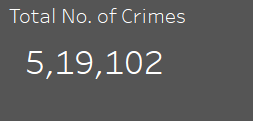
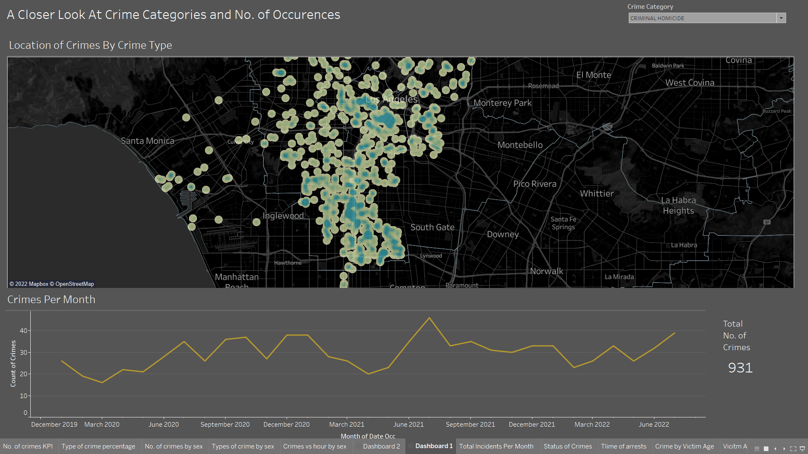
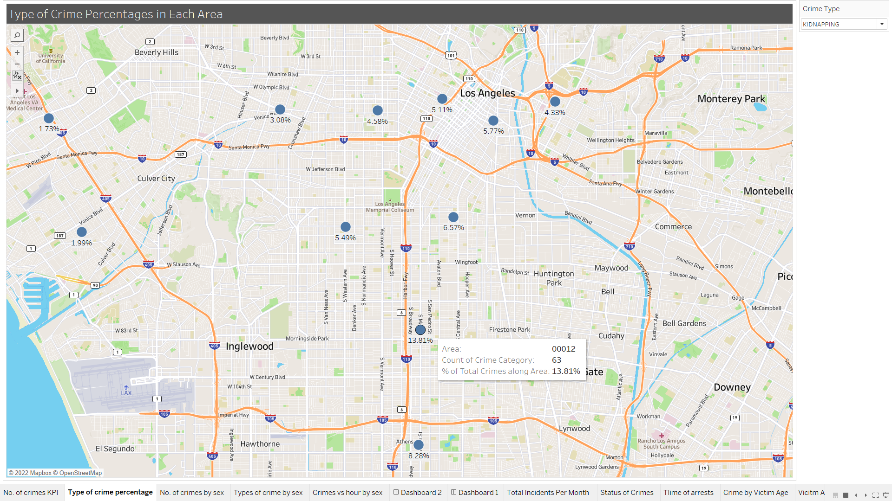



## Authors

- [@RohithOfRivia](https://github.com/RohithOfRivia)

## Table of Contents

  - [Project Description](#project-description)
  - [Data source](#data-source)
  - [Methods](#methods)
  - [Tech Stack](#tech-stack)
  - [Quick glance at the results](#quick-glance-at-the-results)
  - [Findings](#findings)
  - [Limitation and what can be improved](#limitation-and-what-can-be-improved)

## Project Description

In this project, recent criminal activity data based in Los Angeles is analyzed extensively to find patterns and insights for many different aspects of crime. No. occurences for different types of crime, sex of affected victims, weapons used, location and premise of the incident and many more things are investigated with this dataset. 

The user can interact with the [Tableau workbook](https://public.tableau.com/app/profile/rohith.kumar2433/viz/shared/SPT98JK27) for more in-depth and focused visualizations. The first tab that the link lands on contains majority of the dashboards. Please feel free to take a look. 
 
## Data source

- [Crime Data from 2020 to Present](https://data.lacity.org/Public-Safety/Crime-Data-from-2020-to-Present/2nrs-mtv8)

## Tech Stack

- Python (Pandas, Matplotlib)
- Tableau(interface for the model)

## Quick glance at the results

Crimes grand total: 

### Dashboards
**Monthly occurences by category - Map**

 
**No. of incidents by month**
\
\

\
\
**Crime categories vs sex**

\
\
**Age vs type of crimes**

\
\
**Status of investigation and victim sex**

\
\
**Premise & weapons used**

\
\
**Percentage of incidents by area**

## Findings

- Based on the created visualizations and analysis, it is clear that some types of crime have a very clear area where incidents keep being reported. For example, sex trafficking and many related crimes are focused primarily near the Vermont Knolls area. There were a total of 257 crimes reported from Jan 2020 to Aug 2022. 
- Most of these incidents have not yet resulted in an arrest of the offender. Interestingly, 80% of all crimes have not yet resulted in an arrest.

- Top 3 common crimes are vehicle theft, simple assault, and burglary from vehicle. Simple assault has a much higher concentration around the Downtown area. The other two are much more spread out throughout the city. 

- About 25% of crimes are reported to have happened on the street. 45% of crimes occur in confined areas like apartments, garage, vehicles etc. 

 - Battery is the most common type of crime for victims belonging to all age categories. 66% of burglaries occur to a senior, whereas 72% of assaults with a deadly weapon occur to adults. In fact, 60% of all crimes are faced by adults.
 
 - While most crimes occur without any weapons (about 70%), at least 10,400 out of more than 500k incidents involved the use of a handgun. 

- Males are 3 times more likely to fall victim to an assault to a deadly weapon. Females are 3 times more likely to suffer assault from their partners. These incidents have a higher chance to occur during night time. This is when you should be the most careful to stay safe.

## Limitation and what can be improved

- The victim sex is unclear in a large number of incidents, so the data was filtered accordingly for analysis. 

- Statistical tests to confirm if some of the findings are statistically significant. (Correlation test, t-test)

- There are multiple charges pressed for many crimes, and they are provided in this dataset. It could be investigated further to find out relationships between these charges. For example, x% of criminals charged with A is also charged with B.

- More findings to be discovered from the data

## Explore the notebook

To explore the notebook file [here](https://nbviewer.org/github/RohithOfRivia/Crime-in-LA/blob/main/LA%20DV.ipynb)

